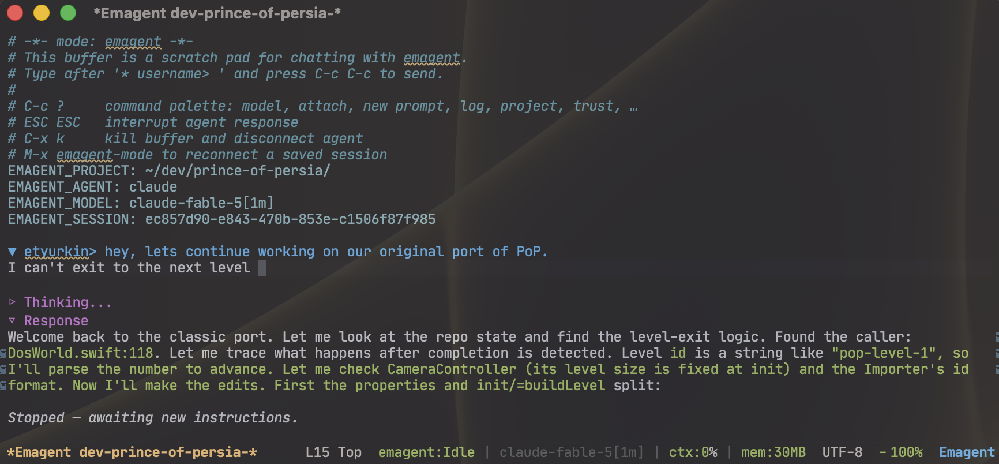

#+TITLE: Emagent - ACP coding agents living in Org buffers
#+AUTHOR: Evgeniy Tyurkin
#+OPTIONS: toc:t num:nil

Emagent keeps *intelligence* in an external ACP agent (Cursor or Claude) and
*execution* in GNU Emacs.  An in-process MCP server exposes Emacs to the agent;
an ACP permission gate validates shell, elisp, and python before anything runs;
the Org buffer is the durable transcript (folded thinking, tool audit trail,
resumable session metadata).

* Requirements

- Emacs 29.1+
- An ACP agent on =PATH=:
  - *Cursor* (default): [[https://cursor.com/cli][Cursor CLI]] → =cursor-agent acp=
  - *Claude*: =npm install -g @agentclientprotocol/claude-agent-acp= and =ANTHROPIC_API_KEY=

** Shell environment

Agent shell commands run as =/bin/zsh -c= (non-interactive; does *not* source
=~/.zshrc=).  Put tools like =mvn=, =node=, and =cargo= in =~/.zshenv= so both
emagent and the agent see them.

#+BEGIN_SRC sh
export PATH="$HOME/.local/bin:$HOME/bin:$PATH"
export PATH="$HOME/.npm-global/bin:$HOME/.jenv/bin:$HOME/.jenv/shims:$PATH"
#+END_SRC

Check Emacs's shell with =(shell-file-name)=.  Use =emagent-extra-exec-paths=
only for binaries Emacs itself must find (=cursor-agent=, =claude-agent-acp=).

* Install

Not on MELPA yet ([[https://github.com/melpa/melpa/pull/10081][melpa/melpa#10081]]).
Until then, install from source:

#+BEGIN_SRC emacs-lisp
(use-package emagent
  :ensure (:host github :repo "etyurkin/emagent" :depth 1
           :files (:defaults ("lisp" . ("lisp/*/*.el"))))
  :commands (emagent emagent-mode))
#+END_SRC

Once the recipe lands: =:ensure t= or =M-x package-install RET emagent RET=.

Emagent probes for =cursor-agent= and =claude-agent-acp=, asks only when both
are present, and defaults to =emagent-default-provider= (='cursor=).  For a local
clone, add =:load-path "~/path/to/emagent"= (repo root; =emagent.el= registers
=lisp/*=).

* Quick start

| Key / command | Action |
|---------------+--------|
| =M-x emagent= | Start a session (infers project cwd; picks an agent) |
| =C-c C-c= | Send the =* user>= prompt (else Org's own =C-c C-c=) |
| =C-c ?= | Palette: connect, model, attach, new prompt, log, trust, … |
| =ESC ESC= | Interrupt the agent |
| =TAB= | Complete =/slash= on the prompt, else =org-cycle= |
| =C-p= / =C-n= | Prompt history on the input line, else move by line |
| =C-a= | Start of your input (past =user>=), else start of line |
| =C-y= | Paste a clipboard image as =[[file:…]]=, else yank |
| =C-x k= | Kill buffer and disconnect |
| =M-x emagent-mode= | Reconnect a saved session buffer |
| =M-x emagent-connect= | Connect/reconnect ACP (=C-c ?= → =c=) |
| =M-x emagent-set-model= | Change session model (=#+EMAGENT_MODEL=) |
| =M-x emagent-set-project-directory= | Move project + session files and reconnect |
| =M-x emagent-trust-workspace= | Write provider trust markers (=C-u= = both) |
| =M-x emagent-trust-claude-reconnect= | Force Claude =session/new= after trust |
| =M-x emagent-reset-permissions= | Clear stored allowlists / fingerprints |

Bindings stay minimal: send, interrupt, palette, plus input-line overrides that
fall through outside the prompt.  Everything else is on =C-c ?=.  Emagent only
shadows =C-c ?= itself (Org table field info is on the palette).

** Prompts

Each turn is a =* username>= Org heading — fold the whole exchange with =TAB=.
Type after the stub and press =C-c C-c= (multiline works; the whole heading is
captured).  Edit an old heading and =C-c C-c= again to re-run it.  =C-c ?= →
New prompt inserts a fresh stub if needed.

=C-u M-x emagent= picks the project directory interactively; otherwise it uses
=default-directory= (or =~/=).  Do *not* edit =#+EMAGENT_PROJECT= by hand —
use =emagent-set-project-directory= so session files move with it.

** Slash commands

Type =/= then =TAB=.  Client commands never reach the agent:

| Command | Action |
|---------+--------|
| =/model= | Model for *this turn only* (link marker; stripped before send) |
| =/mcp= [=server=] | List/authenticate MCP servers; ACP reconnects after login |
| =/usage= | Token samples + session tax (ctx, notes, MCP bytes, …) |
| =/usage baseline= | Snapshot tax for before/after measurement |
| =/usage clear= | Drop baseline (hides =since baseline:=) |
| =/notes= [=text=] | Show or replace session notes |
| =/notes clear= | Empty session notes |
| =/archive= [=force=] | Roll older turns into =NAME-archive/NNN.org= |

Sent to the agent (may compress/reset the ACP session):

| Command | Action |
|---------+--------|
| =/compact=, =/compress=, =/summarize= | Compress prior conversation |

=/model= inserts an Org link (=[[emagent://AGENT/MODEL][short]]=).  Emagent
runs that turn on the chosen model, shows a ~** Thinking (model)~ heading,
then restores the buffer model.  Delete the link to cancel.  On failure,
emagent asks whether to keep it for retry/continue.

* Sessions

Save the buffer (=C-x C-s=).  Files start with =# -*- mode: emagent -*-= and
restore =#+EMAGENT_AGENT=, =#+EMAGENT_SESSION=, =#+EMAGENT_MODEL=, and
=#+EMAGENT_PROJECT=.  Permission allowlists reload from =~/.emagent/=.

Opening a saved file does *not* connect immediately when
=emagent-activate-on-display= is non-nil (default): the buffer stays in
=org-mode= until first displayed, so desktop restore does not spawn N agents.
Set it to =nil= to activate on open.

The agent can only resume a session with at least one completed exchange.  A
buffer saved before any prompt reconnects but starts fresh.

* Session size, notes, and usage

Long chats cost tokens twice: once in the ACP context, again when Org history is
reloaded or compressed.  Emagent keeps the full transcript by default and offers
ways to measure and trim cost without silent data loss.

** Archive

When a *saved* buffer exceeds =emagent-archive-threshold-bytes= (default 1MB),
older turns can move into sibling files =NAME-archive/NNN.org=.  The hot buffer
keeps a short ~* Archive~ TOC with links; chunks link back to the session file.
Text is moved, not deleted.  =emagent-archive-auto= (default =t=) rolls after a
turn when over threshold; unsaved buffers only get a save hint.
=/archive= runs now; =/archive force= skips the size gate.

** Notes

- *Session notes* (=/notes=): durable facts for this chat, injected as
  =[Session notes]= on =session/new= (not scraped from the visible buffer).
- *Project notes*: =~/.emagent/projects/HASH.notes.org= (same HASH as the
  per-project permissions JSON), merged into the same prompt block so
  =/compact= does not keep re-summarizing repo facts.  Nothing is written
  into the project tree.

** Usage and context fill

=/usage= shows recent samples from the local JSONL log plus a *session tax*
line (Emacs context, notes, compressed summary, user text, images, MCP bytes,
system).  =/usage baseline= then later =/usage= prints =since baseline:= deltas
so you can measure a change.  Mode line can show tok/$ when samples exist
(=emagent-usage-show-mode-line=).

Claude reports real context fill as =ctx:N%=.  Cursor ACP does *not* provide
usage statistics
([[https://forum.cursor.com/t/cli-emit-acp-usage-update-so-clients-like-zed-can-show-a-context-window-indicator/165358][upstream request]]);
emagent estimates fill from MCP payload bytes + buffer size against
=emagent-acp-ctx-proxy-size= and shows =ctx:~N%=.  When fill is high, a
=/compact= hint may appear under Response (cooldown-gated; auto-compact is off
by default).

* Response layout

Under each ~* user>~ heading:

- ~** Thinking~ — reasoning and tool lines (~→ tool: path~).  Folds when the
  turn finishes.  Shell, =eval=, and CLI tools render as Org src blocks with
  permission comments; edits show the same unified diff as the permission UI;
  simple reads stay as ~→~ lines.
- ~** Response~ — final answer (Markdown → Org).

** Side notes (=/btw= / palette)

While the agent is busy, =M-x emagent-btw= (or the palette) cancels the
in-flight turn (keeping partial output) and sends =btw, <message>= as a new
prompt — the usual mid-turn steer.

** Self-paced loops (=ScheduleWakeup=)

If the agent ends a turn with =ScheduleWakeup=, emagent arms a timer (10–3600s)
and re-prompts on expiry.  Your own prompt supersedes a pending wakeup;
=ScheduleWakeup= =stop= cancels.  Disable with
=emagent-acp-honor-schedule-wakeup=.

* Providers

** Cursor

Authenticate once: =cursor-agent login=.  Without it, Auto may be rejected.
Mode-line model IDs drop technical suffixes (=claude-sonnet-4-6=, =auto=).
Context fill uses the =ctx:~N%= proxy because Cursor ACP has no usage feed
(see above).

** Claude (Agent SDK)

=claude-agent-acp= is headless — it never shows the CLI trust dialog.  Emagent
writes =~/.claude.json= trust markers when =emagent-trust-enabled= is on (or
use =emagent-trust-workspace=).  Resumed sessions (=session/load=) do *not*
re-read trust; after updating trust run
=emagent-trust-claude-reconnect= (or clear the session id and reconnect) so
Claude does =session/new=.

* MCP tools (op-dispatchers)

Emagent advertises a small set of MCP tools.  Most take an =op= argument; full
op docs live behind =elisp= =op=guide= / =describe= when needed
(=emagent-mcp-compact-schemas= keeps =tools/list= short).

| Tool | Ops / role |
|------+------------|
| =fs= | =read= =write= =undo= =delete= =delete_directory= =list= =find= (writes need =expected_tick=; Lisp → =structural=) |
| =search= | =grep= |
| =git= | =status= =diff= =log= |
| =shell= | =run= (shell) or =compile= (compilation-mode; prefer for builds/tests) |
| =eval= | Evaluate a form in the live Emacs (FS/process blocked) |
| =emacs= | =buffers= =imenu= =project_directory= =where_is= |
| =elisp= | =check= =guide= =apropos= =apropos_doc= =describe= =find_function= |
| =structural= | Lisp sexp edits via [[https://github.com/etyurkin/lisp-sitter][lisp-sitter]] (=tree= =get= =replace= …; mutate needs =expected_tick=) |
| =fetch_url= | HTTP(S) fetch |

Builds (=mvn=, =gradle=, =cargo=, =make=, =npm test=, …) should use
=shell= =op=compile= for navigable errors.

When lisp-sitter is installed, =fs= =op=write= on Lisp files is rejected — use
=structural_*= ops.  Call =elisp= =op=check= before =eval=, and validate before
structural writes.

Repeated large tool results may age into short stubs; file reads at the same
=emagent-tick= return =unchanged since tick N= across turns (=refresh= to force).

* External MCP servers

Claude-compatible agents get =mcpServers= from
=emagent-acp-extra-mcp-config-file= (default =~/.claude.json=).  Cursor uses
=~/.cursor/mcp.json=; emagent also writes project =mcp-approvals.json= and runs
=mcp enable= when needed.  =/mcp= lists servers and runs the provider CLI login;
on success emagent *reconnects the ACP session* so gateway tools load (no manual
=emagent-mode= toggle).

* Permissions

Emagent owns =session/request_permission= UI (inline buttons by default) and
re-validates at execution.  The agent always gets a one-shot allow
(=allow_once=) — even after *Allow always* — so every call still hits the gate.

Keys: =y=/=RET= once, =s= session, =w= always (global), =a= allow-all for
session, =n= deny.

Storage under =emagent-permissions-directory= (default =~/.emagent=):

| File | Contents |
|------+----------|
| =global.json= | *Allow always* fingerprints |
| =sessions/SESSION.json= | Session fingerprints + auto-approve |
| =projects/HASH.json= | Per-project MCP allowlist + fingerprints |
| =projects/HASH.notes.org= | Per-project durable notes (not in the repo) |

=M-x emagent-reset-permissions= clears project / session / global entries.
=emagent-acp-auto-approve-permissions=: =nil= prompt; ='safe= auto-approve
non-destructive; =t= auto-approve anything that passes validation.  This does
not replace Claude Code's own trust layer inside the agent.

** Policy engine

Rules live in =lisp/trust/emagent-policy*.el= (=:id=, =:severity=
=deny=/=confirm=, =:match=).  Highest severity wins.  Extend with
=emagent-policy-extra-*-rules=.

| Case | Result |
|------+--------|
| =kill-emacs=, =pause-emacs= in =eval= | Hard deny |
| Dangerous =eval= symbols / destructive shell | Confirm (again at run time) |
| =fs= =delete= / =delete_directory= | Inline prompt; path under project root |

Allow-always fingerprints never override hard denies.  Workspace trust helpers:
=emagent-trust.el=, =emagent-trust-claude.el=, =emagent-trust-cursor.el=
(=emagent-trust-enabled=).

* Customization

| Variable | Default | Meaning |
|----------+---------+---------|
| =emagent-default-provider= | ='cursor= | =cursor= or =claude= when both exist |
| =emagent-trust-enabled= | =t= | Auto-write provider trust markers |
| =emagent-acp-prefer-emacs= | =t= | Prefer Emacs MCP tools over agent builtins |
| =emagent-acp-file-access= | =t= | Route file I/O through Emacs |
| =emagent-acp-auto-approve-permissions= | =nil= | =nil= / ='safe= / =t= |
| =emagent-acp-confirm-fs-writes= | =nil= | Extra in-editor diff for ACP fs writes |
| =emagent-acp-ctx-proxy-size= | =200000= | Assumed window for Cursor =ctx:~N%= |
| =emagent-acp-compact-hint-threshold= | =80= | % fill that suggests =/compact= |
| =emagent-acp-auto-compact-threshold= | =nil= | Auto =/compress= (off by default) |
| =emagent-acp-auto-explore-model= | =t= | Cheaper model on explore-shaped turns |
| =emagent-archive-auto= | =t= | Roll archive when over threshold |
| =emagent-archive-threshold-bytes= | =1048576= | Archive size gate (1MB) |
| =emagent-archive-keep-turns= | =3= | Turns kept in the hot buffer |
| =emagent-project-notes-filename-suffix= | =.notes.org= | Suffix for =~/.emagent/projects/HASH…= notes |
| =emagent-usage-enabled= | =t= | Append samples to =emagent-usage-file= |
| =emagent-usage-budget-context= | =1500= | Cap Emacs context chars in prompts |
| =emagent-usage-budget-notes= | =2000= | Cap notes block chars |
| =emagent-mcp-compact-schemas= | =t= | Short =tools/list= schemas |
| =emagent-acp-extra-mcp-config-file= | ="~/.claude.json"= | Forward =mcpServers= (nil to disable) |
| =emagent-acp-honor-schedule-wakeup= | =t= | Honor =ScheduleWakeup= timers |
| =emagent-acp-watchdog-timeout= | =300= | Seconds of silence before abort |
| =emagent-activate-on-display= | =t= | Deferred =emagent-mode= on saved files |
| =emagent-shell-block-no-verify= | =t= | Refuse =git --no-verify= |
| =emagent-shell-guard-push= | =t= | Block push when PR already merged |
| =emagent-chat-inactive-bell= | =t= | Bell when agent finishes unfocused |

Destructive =fs= writes still prompt (unified diff).  =/Allow all/ remembers a
tool for the project.  Shell and =eval= also re-check at execution time.

* Related projects

- [[https://github.com/etyurkin/lisp-sitter][lisp-sitter]] — structural Lisp editing behind the =structural= MCP tool
- [[https://github.com/etyurkin/dot-emacs][dot-emacs]] — author's config with emagent wired in

* Acknowledgments

Emagent grew out of an idea by Mike Ivanov, whose feedback shaped it throughout.

* License

MIT.  See [[file:LICENSE][LICENSE]].  Copyright © 2026 [[mailto:etyurkin@kwarks.org][Evgeniy Tyurkin]], [[mailto:mike@daatsys.com][Mike Ivanov]].
